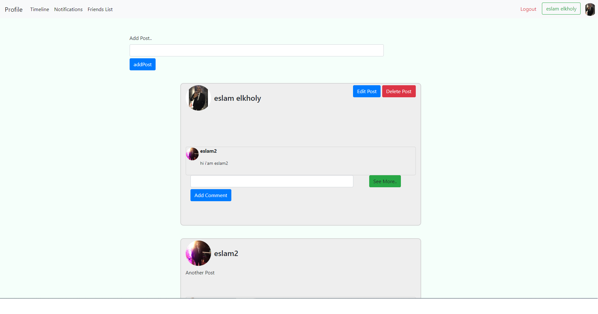
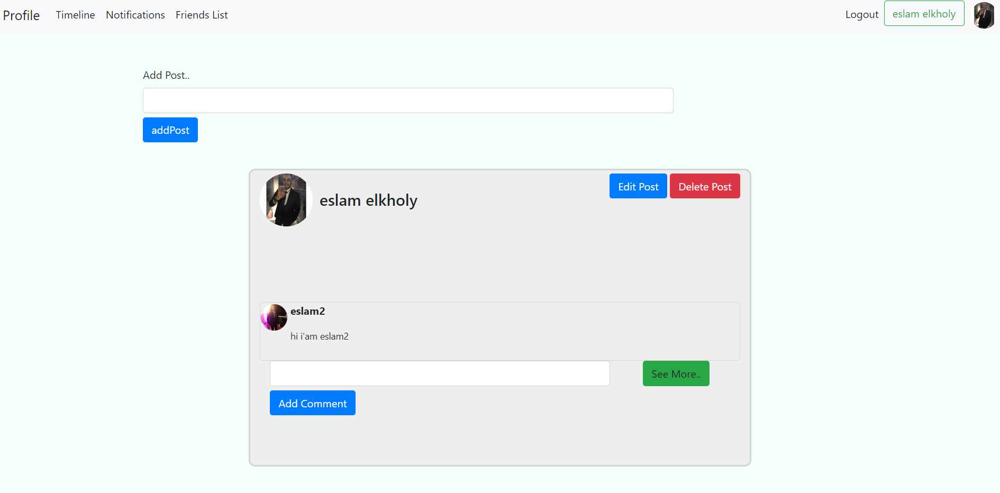
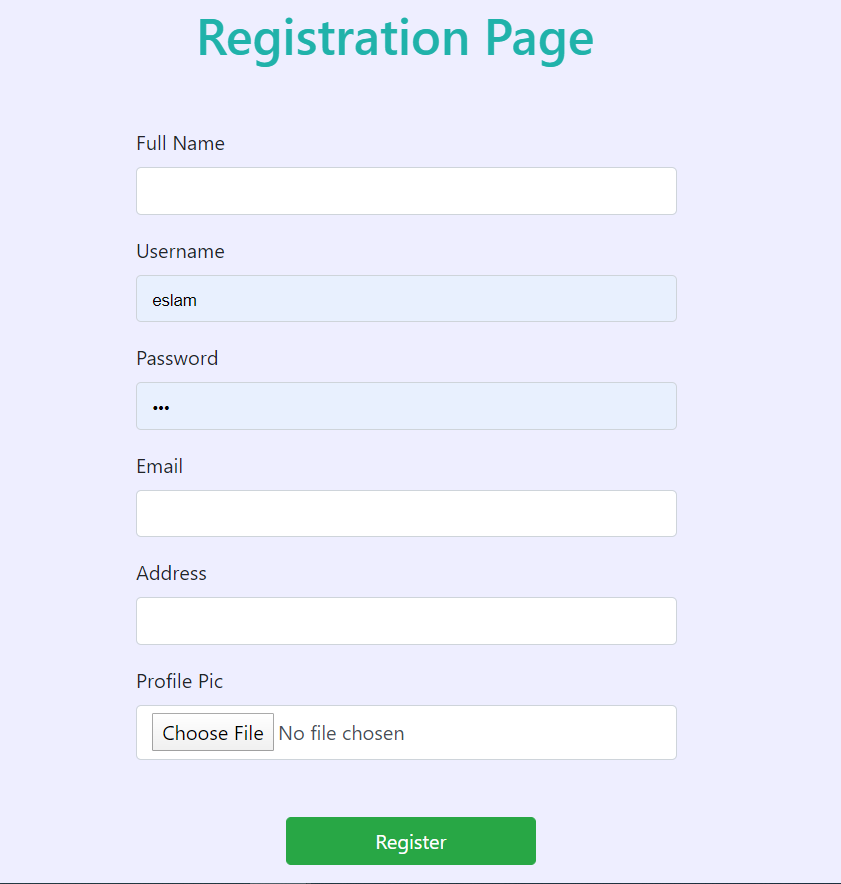
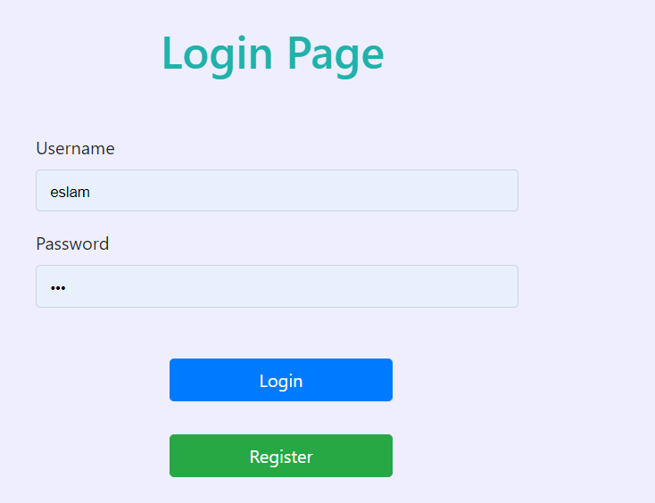

# PHP-MVC-Facebook-Project
### This a Simple Pure PHP Project Using MVC Design Pattern About Facebook Time Line and Users Profiles

### -Project Dependencies
<pre>
1-PHP
2-Mysql
3-MVC Design Pattern
4-HTML 
5-Bootstrap
6-Jquery
</pre>
### -Project Requirements
<pre>
1-User can Register With his own data And His Profile Picture
2-After Login Can See All Post At The TimeLine
3-Can only Delete/Update his own Post & Comments
4-User Can Leave Comment on any Post
5-User Profile To See All his Own Posts
</pre>
### -Project Pictures

